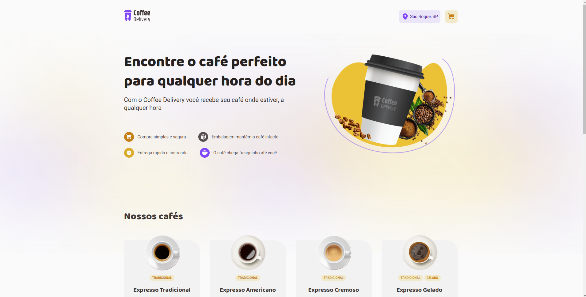
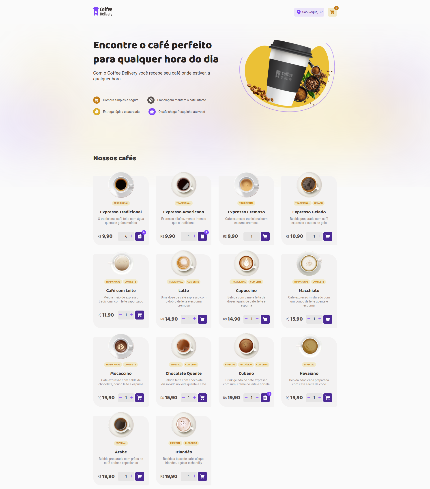
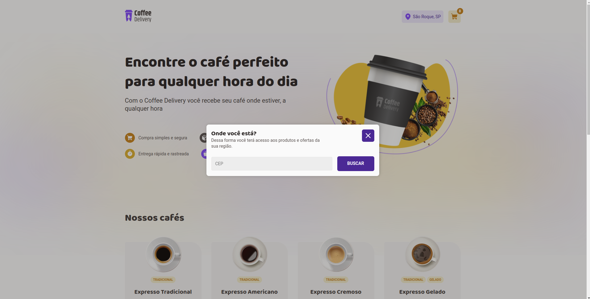
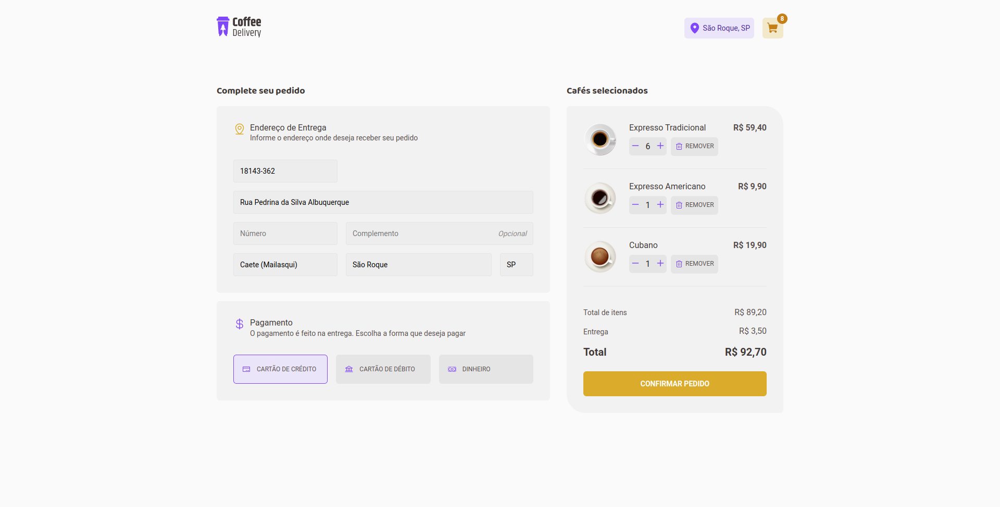
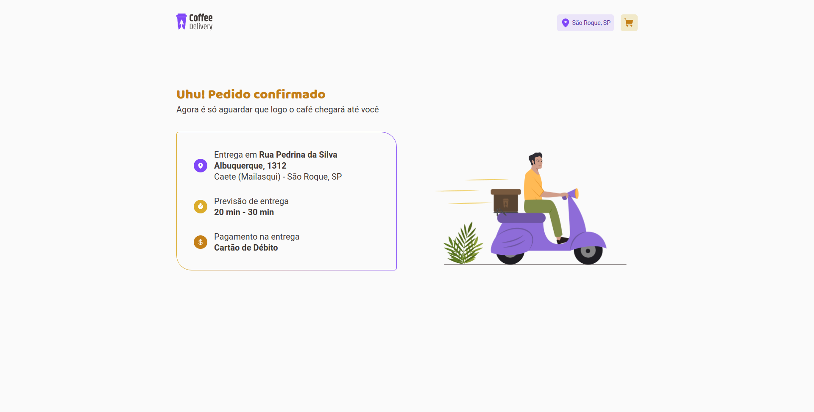
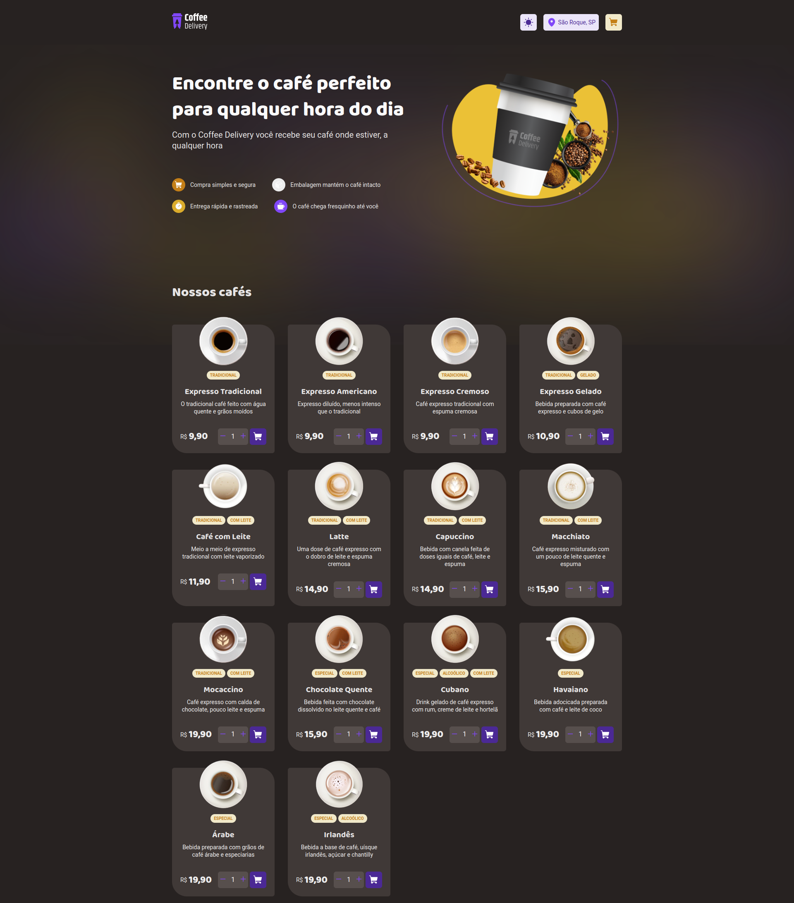
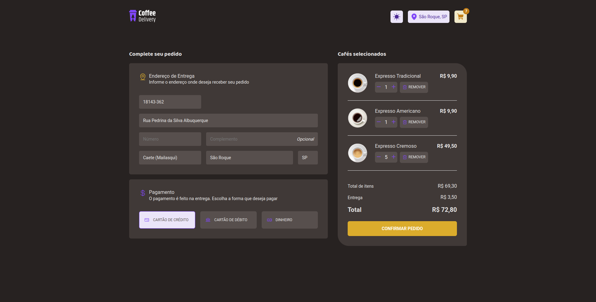

<h2 align="center">
  <div>
    
  <div>
</h2>

<h1 align="center">
  Coffee Delivery
</h1>

<p align="center">
  <a href="https://andrejr.dev">
    
  </a>
</p>

<p align="center"> Aplicação desenvolvida no segundo módulo da trilha de React do Ignite 💻🚀 </p>

<p align="center">
  <a href="#rocket-tecnologias">Tecnologias</a>&nbsp;&nbsp;&nbsp;|&nbsp;&nbsp;&nbsp;
  <a href="#information_source-como-instalar">Como instalar</a>&nbsp;&nbsp;&nbsp;
</p>

Nesse desafio, foi proposto desenvolver uma aplicação para gerenciar um carrinho de compras de uma cafeteria fictícia, que contém as seguintes funcionalidades:

- Listagem de produtos (cafés) disponíveis para compra
- Adicionar uma quantidade específicas de itens no carrinho
- Aumentar ou remover a quantidade de itens no carrinho
- Formulário para o usuário preencher o seu endereço
- Exibir o total de itens no carrinho no Header
- Exibir o valor total da soma de itens no carrinho multiplicados pelo valor

Adicionais:

- Tema dark
- Pesquisa cep

## :rocket: Tecnologias

Este projeto foi desenvolvido com as seguintes tecnologias:

- [ViteJS](https://vitejs.dev/)
- [ReactJS](https://reactjs.org)
- [Typescript](https://www.typescriptlang.org/)
- [Styled Components](https://styled-components.com/)
- [Eslint](https://eslint.org/)
- [React Router](https://reactrouter.com/)
- [React Hook Form](https://react-hook-form.com/)
- [Phosphor Icons](https://phosphoricons.com/)

## :information_source: Como instalar

Para clonar e executar este aplicativo, você precisará do [Git](https://git-scm.com) instalado em seu computador. Da sua linha de comando:

```bash
# Clonar este repositório
$ git clone https://github.com/andrejr971/coffe-delivery.git

# Navegue até o repositório
$ cd coffe-delivery

#instale os pacotes
$ yarn
# ou
$ npm install

# atualize o arquivo .env.example com as suas credenciais do graphcms

# renomei o aquivo .env.example para .env.local

# Execute a aplicação em modo de desenvolvimento
$ yarn dev
# ou
$ npm run dev

# A aplicação será aberta na porta:3000 - acesse http://localhost:300
http://localhost:3000
```

<br />

## Capturas

<h1 align="center">
    
    
    
    
    
    
    
</h1>
<br />

---

Feito by André Junior :wave: [portifólio](https://andrejr.dev)
